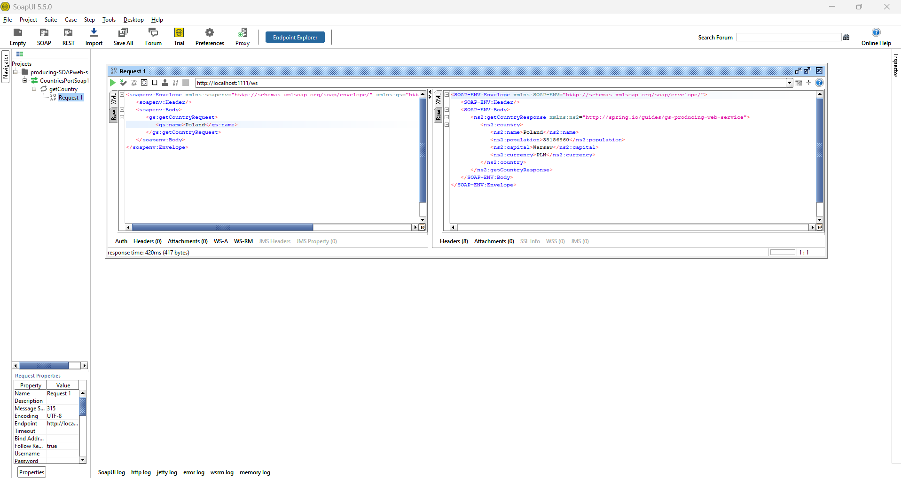
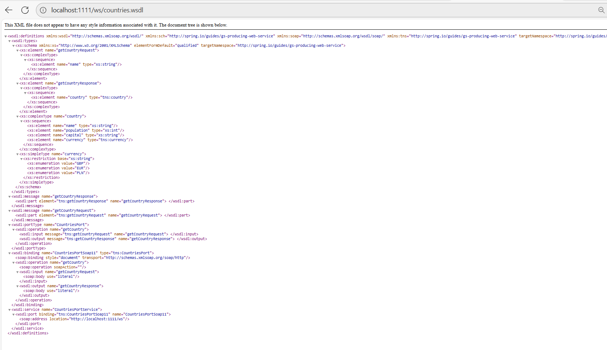
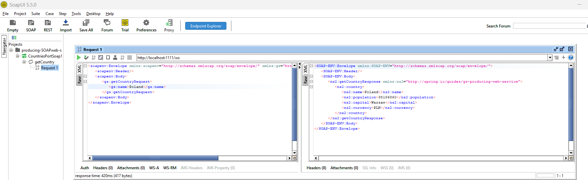

# producer-SOAPweb-service2
WSDL-based SOAP web service
## Description

An in-depth paragraph about your project and overview of use.

## Getting Started
Server that exposes data from various EU countries Data by using a WSDL-based SOAP web service.
### Dependencies

* A favorite text editor or IDE

Java 17 or later

spring-boot 3.0.0+

Dependencies and select Spring Web and Spring Web Services.
### POM.XML

add wsdl4j changes in  the pom.xml file if you use Maven:

<dependency>
	<groupId>wsdl4j</groupId>
	<artifactId>wsdl4j</artifactId>
</dependency>

### Applications
Once you clone the application, check above all is ready and run the application in IDE

### Test the Application using SOAPUI
If the application is running, you can test via SOAPUI.You need to down load the soapUI:https://www.soapui.org/downloads/soapui/soapui-os-older-versions/
and install and provide the request. to test the producerside.

### Test the Application in Browser
URL:http://localhost:1111/ws/countries.wsdl

### Test the Application using SOAPUI_2

